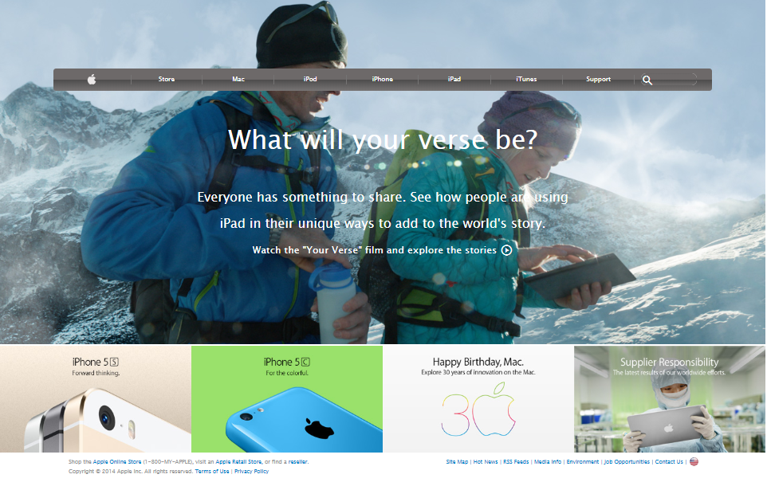

# Project 4 - Building with Backgrounds and Gradients

This is an assigned solo project where I have to replicate/clone the <a href="https://web.archive.org/web/20140301004610/http://www.apple.com/">Apple web page.</a>

## Preview of web page



## Built With

- HTML5
- CSS3
- <a href="https://materializecss.com/icons.html">Google icons</a>
- SVG icons

## Live Demo

[Live demo](https://raw.githack.com/chelmerrox/Project-4-Building-with-Backgrounds-and-Gradients/project-draft/index.html)

## Getting Started

To get a local copy up and running follow the simple steps outlined below.

## How To Use 🔧

From your command line, do the folowing steps below:
​
1. Clone the projects' repository into your machine.

```bash
# Clone this repository
$ git clone git@github.com:chelmerrox/Project-4-Building-with-Backgrounds-and-Gradients.git

```
2. Change directory/Go into the repository with the command below.

```bash
$ cd Project-4-Building-with-Backgrounds-and-Gradients

```

## Author

👤 **Losalini Rokocakau**

- Github: [@chelmerrox](https://github.com/chelmerrox)
- Twitter: [@chelmerrox](https://twitter.com/chelmerrox)
- Linkedin: [Losalini Rokocakau](https://linkedin.com/losalini-rokocakau)

## 🤝 Contributing

Contributions, issues and feature requests are welcome!

Feel free to check the [issues page](https://github.com/chelmerrox/Project-4-Building-with-Backgrounds-and-Gradients/issues).

## Show your support

Give a ⭐️ if you like this project!

## Acknowledgments

- My Stand-Up Team
- Microverse TSE's
- <a href="https://github.com/BrittanyBlake">My Mentor</a>

## 📝 License

This project is [MIT](LICENSE.txt) licensed.
